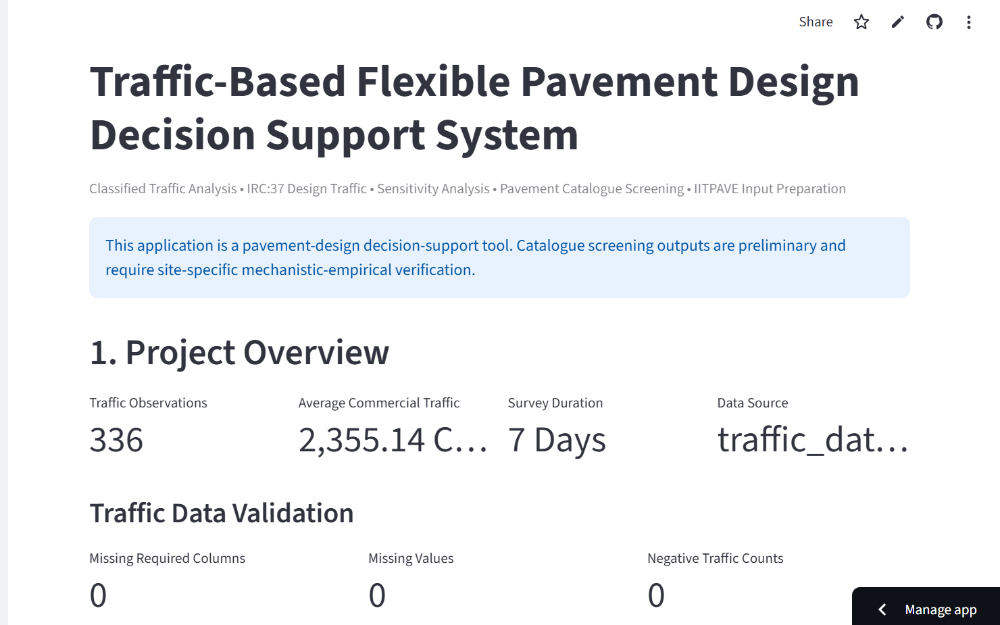
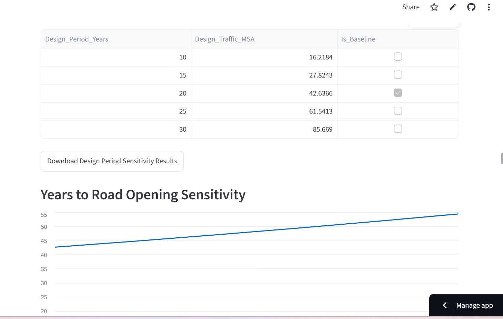
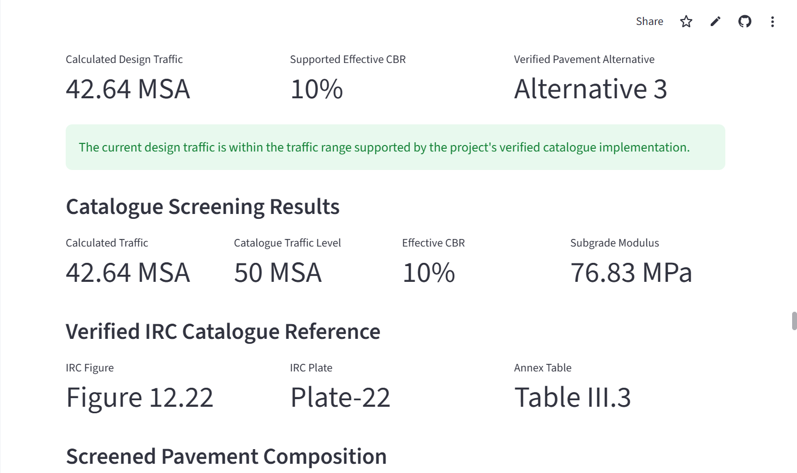

# Intelligent Traffic-Based Flexible Pavement Design and Analysis System

[](https://github.com/payas-sahu/Traffic-Based--Flexible-Pavement-Design/actions/workflows/tests.yml)

## Live Application

The deployed Streamlit application is available here:

[Open the Intelligent Traffic-Based Flexible Pavement Design and Analysis System](https://traffic-based--flexible-pavement-design-psprjm7sttumb7pppyadck.streamlit.app/)

## Project Status

**Current Stage:** Deployed Functional MVP / Engineering Decision-Support Prototype

The application currently includes:

- Classified traffic-data processing and validation.
- IRC:37-based cumulative design traffic calculation.
- Dynamic sensitivity analysis and parameter-influence ranking.
- Verified IRC catalogue screening for the currently implemented pavement cases.
- IITPAVE structural and loading input preparation.
- Multi-scenario traffic and pavement comparison.
- Interactive Streamlit dashboard.
- Automatic engineering PDF report generation.
- 86 automated engineering-logic tests.
- GitHub Actions continuous integration.
- Public deployment using Streamlit Community Cloud.

The project is actively being developed toward expanded IRC catalogue coverage, mechanistic-empirical pavement verification, automated IITPAVE result interpretation, and additional engineering validation.

A Python-based highway engineering decision-support application for analyzing classified traffic data...

A Python-based highway engineering decision-support application for analyzing classified traffic data, estimating cumulative design traffic, performing sensitivity and scenario analyses, screening verified flexible pavement catalogue cases, preparing IITPAVE structural inputs, and generating engineering PDF reports through an interactive Streamlit dashboard.

## Application Screenshots

### Project Overview

The overview dashboard summarizes the traffic dataset, average commercial traffic, survey duration, data source, and validation results.



### IRC:37 Design Traffic Analysis

The design-traffic module allows interactive modification of growth rate, design period, road-opening delay, Vehicle Damage Factor, and lateral distribution factor, with automatic recalculation of cumulative design traffic.


### Sensitivity Analysis

The sensitivity-analysis module evaluates the effect of engineering input variations and provides a range-based parameter influence ranking for decision support.



### Pavement Catalogue Screening and IITPAVE Preparation

The pavement module performs screening against the currently implemented verified IRC catalogue cases and prepares structural inputs for subsequent IITPAVE analysis.



## Project Objectives

The application is developed to:

- Process and validate classified traffic-volume data.
- Calculate average commercial traffic in CVPD.
- Estimate cumulative design traffic in Million Standard Axles (MSA).
- Apply traffic growth rate, design period, road-opening delay, Vehicle Damage Factor (VDF), and lateral distribution factor.
- Perform dynamic sensitivity analysis.
- Rank parameter influence within tested scenario ranges.
- Compare multiple pavement-design traffic scenarios.
- Screen implemented and verified IRC catalogue cases.
- Estimate subgrade modulus from effective CBR.
- Prepare structural and loading inputs for further IITPAVE analysis.
- Generate downloadable engineering PDF reports.
- Validate core engineering calculations through automated tests.

## Engineering Workflow

```text
Classified Traffic Data
        |
        v
Data Loading and Validation
        |
        v
Average Commercial Traffic (CVPD)
        |
        v
IRC:37 Design Traffic Calculation
        |
        v
Sensitivity Analysis
        |
        v
Parameter Influence Ranking
        |
        v
Verified IRC Catalogue Screening
        |
        v
IITPAVE Input Preparation
        |
        v
Multi-Scenario Comparison
        |
        v
Engineering PDF Report Generation